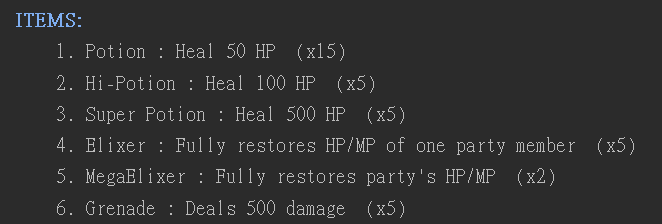

# RPG 戰鬥腳本 
<a href="https://www.udemy.com/python-complete/learn/v4/overview">此腳本為
The Complete Python 3 Course: Beginner to Advanced!課堂練習</a> 
使用python寫的簡易RPC腳本遊戲 
總共有三個腳色和一個敵人 
1.為物理攻擊 
2.為魔法攻擊 
 
3.使用物品 
 
以下為遊戲畫面: 
